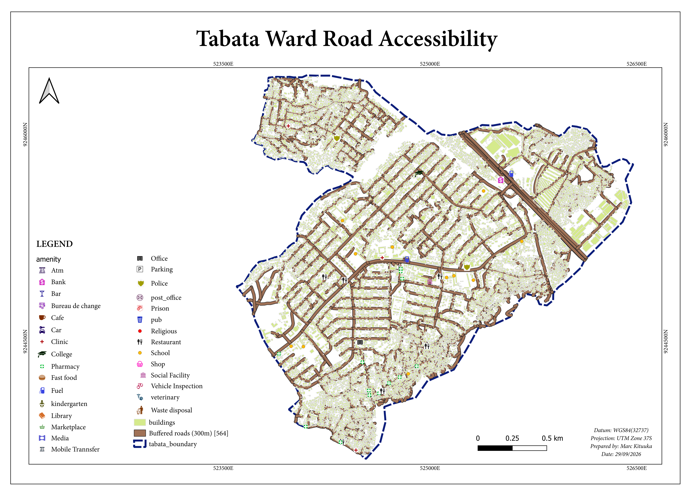

# Tabata Ward Road Accessibility

**Which residential buildings in Tabata Ward, Ilala Municipality, Dar es Salaam are located more than 300 metres from the nearest paved road, and what does this mean for their access to schools and health facilities?**

A four-week (Month 1) GIS project using QGIS and OpenStreetMap / HOTOSM data, in EPSG:32737 (WGS 84 / UTM zone 37S).

## The answer in short

**Which buildings?**
- **5,652 of 9,884 residential buildings (57.2%) are more than 300 m from the nearest paved road.** The farthest is 1,150 m away. The full list, with each building's distance and location, is in [the results file](results/residential-buildings-over-300m-from-paved-road.csv).
- They are mostly in the north-western lobe (all 1,334 buildings there) and the south-central part of the ward (about 8 in 10). None are in the north-east along Nelson Mandela Road.
- **1,250 of them are certain. The other 4,402 need a check:** they are within 300 m of the ward edge, and the road data stops at the edge, so a paved road just outside Tabata might be closer. They are marked in the list.
- "Paved" means the OpenStreetMap road tag says asphalt, concrete or paved. Only 7.3 km of the 84.3 km of mapped roads and paths are paved.

**What does it mean for access?**
- **Health facilities:** the distance is about the same as for the other buildings (about 490 m in a straight line), but 686 of these buildings are more than 1 km from a health facility. The data has only 8 hospital footprints, so treat this with care.
- **Schools:** these buildings are not farther from a school than the others (median 237 m, against 281 m).
- **The catch:** the distance is similar, but the way there is different. Almost all of these buildings sit next to unpaved roads and footpaths, so getting to a clinic or school is probably slower and harder, especially for vehicles. This was not measured.



## Start here: all four weeks

| Week | What it is | Link |
|---|---|---|
| 1 | Project brief, with a source link for every dataset | [week-1-project-brief/project-brief.md](week-1-project-brief/project-brief.md) |
| 2 | Data notes: what was downloaded | [week-2-data-notes/data-notes.md](week-2-data-notes/data-notes.md) |
| 3 | Data preparation and the five quality checks | [week-3-prepared-data/data-preparation-note.md](week-3-prepared-data/data-preparation-note.md) |
| 3 | Quality checks on the Tabata layers | [week-3-prepared-data/tabata-quality-checks.md](week-3-prepared-data/tabata-quality-checks.md) |
| 4 | Map image | [week-4-analysis/tabata-road-accessibility-map.png](week-4-analysis/tabata-road-accessibility-map.png) |
| 4 | Month 1 summary (the analysis and result) | [week-4-analysis/month-1-summary.md](week-4-analysis/month-1-summary.md) |
| 4 | List of the 5,652 buildings over 300 m | [results/residential-buildings-over-300m-from-paved-road.csv](results/residential-buildings-over-300m-from-paved-road.csv) |
| 4 | All residential buildings with distances (open in QGIS) | [results/residential-buildings-distances.gpkg](results/residential-buildings-distances.gpkg) |

## Folder layout

```
tabata-road-accessibility/
├── README.md
├── week-1-project-brief/
│   └── project-brief.md
├── week-2-data-notes/
│   └── data-notes.md
├── week-3-prepared-data/
│   ├── data-preparation-note.md
│   ├── tabata-quality-checks.md
│   └── data/tabata_analysis.gpkg  (all five input layers in one file)
├── week-4-analysis/
│   ├── tabata-road-accessibility-map.png
│   └── month-1-summary.md
└── results/                       (the building list and the distances layer)
```

## Data sources

| Dataset | Source |
|---|---|
| Roads, amenities, ward boundary | OpenStreetMap, <https://www.openstreetmap.org/> (via QuickOSM) |
| Buildings, road export | HOTOSM Export Tool, <https://export.hotosm.org/v3/> |
| Dar es Salaam boundary (Week 3) | GADM, <https://gadm.org/> (via the HCMGIS plugin in QGIS) |

Per-dataset detail is in [Week 1](week-1-project-brief/project-brief.md) and [Week 2](week-2-data-notes/data-notes.md).

## Limitations

- The road data stops at the ward boundary, so buildings near the edge (4,402 of the 5,652) may be closer to a paved road outside Tabata.
- Distances are in a straight line, not the distance you would travel.
- The result depends on the OpenStreetMap `surface` tag, which may under-record real paving. If compacted roads are also counted as paved, the number drops to 2,732 buildings (28%).
- Only buildings tagged `residential` are counted. 5,472 buildings with no type (`yes`) and 631 mixed-use buildings are left out.
- Health facilities are only 8 hospital footprints. Clinics and pharmacies are not yet included.
